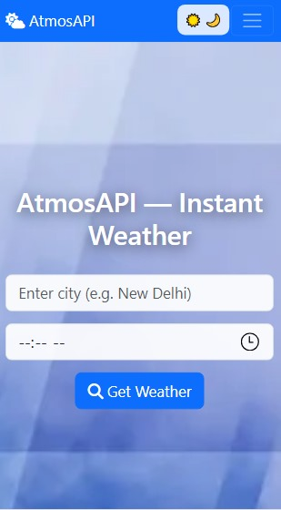

# AtmosAPI

> *Plan your adventures with confidence.*  
> WeatherWise predicts the likelihood of  
> *very hot, **very cold, **very windy, **very wet, or **very uncomfortable* conditions  
> for any location and date you choose.

*✨ Features*

-🔍 *Smart Query* – Enter a location and date to see detailed risk levels.
-📊 *Data-Driven* – Uses real Earth-observation & historical climate datasets.
-🎨 *Personalized Interface* – Intuitive, mobile-friendly UI for quick planning.
-🌎 *Global Reach* – Works for cities, trails, lakes, and more worldwide.
-⚡ Fast Results** – Instant forecasts and visual risk indicators.

## 🖼 Demo

| Live App | Screenshot |
|---------|------------|
| [👉  try apk**](https://storage.appilix.com/uploads/app-apk-68d29b6834934-1758632808.apk) [👉 Try web**](https://atmosapi-1.onrender.com/) |  |
